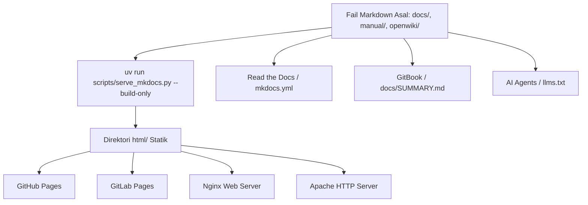

# Seni Bina Dokumentasi Diátaxis & Penerbitan Pelbagai Pelantar

Dokumentasi **Linux for NOSS Malaysia (DSOM)** direka bentuk di atas prinsip teras **"Markdown-First & Diátaxis-Governed"**. Ini memastikan setiap modul ilmu boleh diakses secara langsung sebagai teks tulen (*pure Markdown*) atau dijana sebagai laman web statik berprestasi tinggi untuk pelbagai pelantar pengehosan moden.

---

## 1. Kerangka Diátaxis (Diátaxis Framework)

Berasaskan standard [Diátaxis Documentation Framework](https://deep-state-of-mind-for-my-ai.readthedocs.io/en/latest/explanation/diataxis/), maklumat disusun mengikut niat pengguna (*user intent*) dan fasa pemerolehan kemahiran kepada empat kuadran:

```text
                           ORIENTASI PENGGUNA
                 Pembelajaran (Learning)      Praktikal (Practical)
               +---------------------------+---------------------------+
               |        1. TUTORIALS       |     2. HOW-TO GUIDES      |
  Pemerolehan  |   (Pembelajaran Berpandu) |  (Panduan Masalah/Tugas)  |
  Kemahiran    |  - Langkah mula pemula    |  - Resipi operasi spesifik|
  (Acquisition)|  - Onboarding amali       |  - Panduan kerja SysAdmin |
               +---------------------------+---------------------------+
               |      3. EXPLANATION       |       4. REFERENCE        |
  Kefahaman    |    (Penerangan Konsep)    |    (Rujukan Fakta/Data)   |
  Mendalam     |  - Falsafah GPL & Sejarah |  - Jadual & Sintaks arahan|
 (Understanding|  - Senibina Isirung/OS    |  - Matriks NOSS CU/WA     |
               +---------------------------+---------------------------+
```

### Pembahagian Kuadran dalam Repositori

1. **Tutorials (`docs/tutorials/`)** — *Learning-oriented*:
   - Menumpukan kepada proses pembelajaran langkah-demi-langkah bagi pemula.
   - Contoh: Pemasangan pertama Ubuntu 26.04 LTS atau AlmaLinux 10, pengenalan terminal.
2. **How-To Guides (`docs/how-to/`)** — *Problem-oriented*:
   - Resipi berfokus untuk menyelesaikan tugasan atau masalah sebenar dalam operasi Linux harian.
   - Contoh: Konfigurasi IP Statik dengan `nmcli`, penyediaan storan LVM, enkripsi cakera penuh LUKS2.
3. **Explanation (`docs/explanation/`)** — *Understanding-oriented*:
   - Perbincangan falsafah, konsep asas, sejarah, dan seni bina sistem.
   - Contoh: Falsafah Lesen GNU GPL, evolusi isirung Linux, tadbir urus DSOM, dan penjajaran NOSS.
4. **Reference (`docs/reference/` & `manual/`)** — *Information-oriented*:
   - Lembaran fakta teknikal, spesifikasi arahan, modul amali NOSS standard (CU01–CU06), jadual pemetaan CU/WA NOSS, dan senarai pemboleh ubah tanpa penerangan yang meleret.

---

## 2. Prinsip Markdown-First & Format Dwicapaian

Setiap dokumen di dalam projek ini mematuhi prinsip **Format Dwicapaian (Dual-Format Delivery)**:

### A. Capaian Terus Teks Tulen (Pure Markdown `.md`)
- **Navigasi Terpaut (Relative Links):** Semua pautan silang dokumen menggunakan pautan fail `.md` berkait (contoh: `[Topik 1](../openwiki/topic-01.md)`).
- **Kemandirian Format:** Boleh dibaca secara luar talian (*offline*), dalam penyunting kod (VS Code, Vim, Nano), aplikasi nota berasaskan Markdown (Obsidian, Logseq), atau terus melalui antaramuka repositori GitHub/GitLab tanpa memerlukan kompilasi.

### B. Penjanaan Laman Statik Web (Static HTML Generation)
- Menggunakan penjana dokumentasi moden berasaskan **MkDocs Material** yang dipacu melalui automasi Python `uv`.
- Menggunakan mod pautan berkait (`use_directory_urls: false`) supaya fail HTML yang dijana ke dalam direktori `html/` boleh dibuka terus melalui protokol `file:///` tanpa wajib memulakan pelayan web.

---

## 3. Keserasian Pelantar Penerbitan (Multi-Platform Publishing)

Laman web dan dokumen yang dihasilkan daripada projek ini menyokong secara natif pelbagai pelantar pengedaran:



### 1. GitHub Pages & GitLab Pages
- Tapak web statik di direktori `html/` boleh diterbitkan terus melalui *Action/Pipeline* CI/CD.
- Sesuai untuk akses awam percuma di bawah domain organisasi atau projek.

### 2. Read the Docs
- Disokong secara natif melalui fail konfigurasi `mkdocs.yml` di direktori punca repositori.

### 3. GitBook
- Disokong melalui fail indeks navigasi standard `docs/SUMMARY.md` yang dijana oleh skrip `scripts/build_diataxis_docs.py`.

### 4. Pelayan Web Sendiri (Nginx & Apache)
- Pentadbir sistem hanya perlu menghalakan `root` atau `DocumentRoot` terus ke direktori `html/`:
  - **Nginx:** `root /var/www/skills-noss/html; index index.html;`
  - **Apache:** `DocumentRoot "/var/www/skills-noss/html"`

### 5. Ejen AI & LLM (Machine-Readable Context)
- Menyokong spesifikasi terbuka [llmstxt.org](https://llmstxt.org) melalui fail `llms.txt`, `llms-full.txt`, dan `llms_context.xml` untuk memudahkan ejen AI memahami keseluruhan konteks repositori secara padat.

---

## 4. Struktur Organisasi Repositori DSOM

| Direktori | Peranan dalam DSOM | Kuadran Diátaxis / Fungsi |
| :--- | :--- | :--- |
| `docs/` | Dokumentasi rasmi projek | Mengandungi sub-direktori 4 kuadran Diátaxis (`tutorials/`, `how-to/`, `explanation/`, `reference/`). |
| `manual/` | *Sovereign Manual NOSS* | Kandungan modul amali teknikal Linux yang dipetakan mengikut Unit Kompetensi NOSS (`cu01/` hingga `cu06/`). |
| `openwiki/` | *Narrative Topic Indexes* | Indeks naratif utama mengikut topik silibus latihan TVET Malaysia. |
| `.agents/brain/` | *Agent Memory & Spatial Palace* | Memori episodik (`task.md`, `walkthrough.md`) dan Memori Ruang Loci (`wings/`, `palace_registry.md`). |
| `references/manual/` | *Raw Legacy Archive* | Arkib simpanan bahan mentah manual lama yang telah dibersihkan daripada penanda lapuk. |
| `.agents/skills/` | *Executable AI Skills* | Kemahiran dan prosedur operasi standard untuk ejen AI melaksana tugasan autonomi. |
| `html/` | *Static Web Output* | Hasil binaan laman web statik sedia-edar untuk pelayan web. |

---

## 5. Arahan Penggunaan Pantas (Quickstart Commands)

```bash
# 1. Menjana struktur Diátaxis, rujukan tools, dan llms.txt
uv run scripts/build_diataxis_docs.py

# 2. Menjana tapak web statik HTML (untuk GitHub Pages / Nginx / Apache / Offline)
uv run scripts/serve_mkdocs.py --build-only

# 3. Menjalankan pelayan pembangunan tempatan secara interaktif (Live Preview)
uv run scripts/serve_mkdocs.py

# 4. Melaksanakan ujian pematuhan kualiti 100% (Quality Gate)
uv run run_all_tests.py
```

---

## 6. Ekosistem Pelbagai Format Bahan (Multi-Artifact Deliverables)

Di samping penstrukturan dokumen Diátaxis, ekosistem ini menyokong transformasi kandungan kepada pelbagai jenis artifak:
- **Matriks Kurikulum DOCX (JPK Format):** Dijana automatik untuk keperluan pensijilan TVET melalui kemahiran `.agents/skills/noss-cocu-docx-formatter/`.
- **Slaid Pembentangan Visual (PPTX / ODP):** Modul syarahan dan bengkel 3 lajur menggunakan `.agents/skills/odp-slide-generator/`.
- **Buku & Cadangan Teknikal (PDF):** Dokumen berskala penuh berasaskan enjin Pandoc XeLaTeX.
- **Konteks AI / FastMCP:** Peta pengetahuan padat melalui `llms.txt`, `llms-full.txt`, `llms_context.xml`, dan protokol FastMCP.
- **Templat Pengeluaran DevOps:** Konfigurasi Nginx, Apache, Podman Quadlet, dan skrip automasi Ansible.

---
*Linux for NOSS Malaysia (Sovereign Manual) | Harisfazillah Jamel (LinuxMalaysia) | 2026-08-17*  
*Standard: UK English | DBP-standard Bahasa Melayu Malaysia (Piawai) | Dwi-Lesen: CC BY-SA 4.0 (Kandungan) / MIT (Skrip) | [Notis Perundangan, Privasi & Penafian](/docs/legal-notice.md)*
