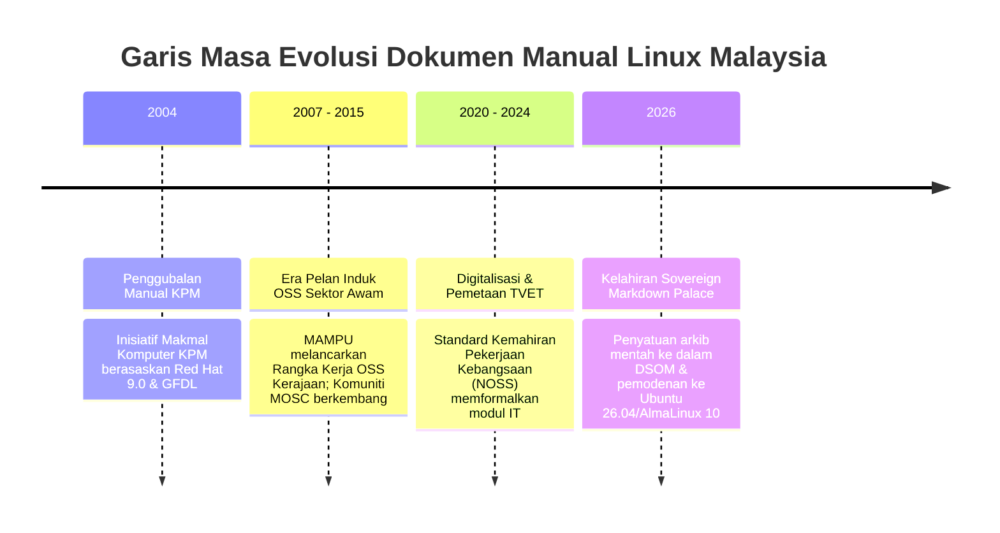

# Sejarah & Asal-Usul Dokumen Manual Linux KPM (2004–2026)

## 1. Pengenalan & Konteks Sejarah (Era 2002–2004)

Bahan mentah yang disimpan di dalam direktori `references/manual/` merupakan khazanah sejarah penting dalam gerakan **Perisian Sumber Terbuka (Open Source Software - OSS)** di Malaysia. Dokumen ini asalnya digubal sekitar tahun **2003–2004** di bawah inisiatif berskala nasional:

> **Tajuk Dokumen Asal:**  
> *Ministry of Education : Computerisation (IT Lab) - Infrastruktur Sistem & Linux (Panduan Pengajar & Pelatih)*  
> *Tarikh Rujukan Rasmi: Mei 2004*  
> *Pelesenan Asal: GNU Free Documentation License (GFDL)*

### Latar Belakang Projek Makmal Komputer KPM
Pada awal dekad 2000-an, Kementerian Pendidikan Malaysia (KPM) telah melancarkan **Projek Pengkomputeran Makmal Sekolah** secara besar-besaran di seluruh negara (selaras dengan aspirasi Sekolah Bestari dan Pelan Induk Pembudayaan ICT). Bagi membina infrastruktur pelayan intranet sekolah yang mampan, selamat, dan bebas lesen komersial yang mahal, teknologi **Linux (khususnya Red Hat Linux 9.0)** telah dipilih sebagai tunjang infrastruktur pelayan dan makmal komputer sekolah.

Dokumen manual ini dirangka sebagai modul latihan komprehensif bagi melatih para guru penyelaras ICT, juruteknik, dan instruktor makmal untuk menguasai:
- Pemasangan dan pentadbiran sistem operasi Linux (Red Hat 9 / GNOME Desktop).
- Perkhidmatan rangkaian setempat (DHCP, DNS BIND, Sambungan Fail Samba/NFS).
- Kawalan keselamatan, pengurusan pengguna (*user management*), dan perkongsian pencetak.
- Pemahaman undang-undang siber di bawah **Akta Hak Cipta 1987** dan prinsip pelesenan **GNU General Public License (GPL)**.

---

## 2. Tokoh & Penggerak Komuniti Sumber Terbuka

Pembangunan bahan latihan ini dipacu oleh para perintis komuniti sumber terbuka tempatan, antaranya **Harisfazillah Jamel (LinuxMalaysia)** yang merupakan aktivis gigih, penceramah, dan penulis buku-buku Linux terkemuka di Malaysia, bersama komuniti penggerak seperti **Malaysian Open Source Community (MOSC)**.

Melalui perkongsian terbuka di pelbagai portal perintis seperti *Laman Ilmu Cyber*, komuniti ini gigih menyebarkan kepakaran teknikal Linux kepada ribuan pendidik dan juruteknik sekolah di seluruh pelosok semenanjung, Sabah, dan Sarawak.

---

## 3. Garis Masa Evolusi: Dari Makmal Sekolah ke DSOM NOSS (2004 ➔ 2026)

---

## 4. Keperluan Pemodenan & Anjakan Paradigma ke NOSS

Walaupun nilai pedagogi dan falsafah asas manual 2004 tersebut kekal relevan, evolusi teknologi memerlukan anjakan paradigma yang menyeluruh:

| Aspek | Dokumen Asal (2004) | Sovereign Markdown Palace (2026) |
| :--- | :--- | :--- |
| **Sistem Rujukan** | Red Hat 9.0 (Isirung 2.4, era 2003) | **Ubuntu 26.04 LTS**, **AlmaLinux 10**, **Fedora 43** |
| **Sistem Paparan/GUI** | XFree86 / GNOME 2.2 / KDE 3 | **GNOME 48 / Wayland** |
| **Storan & Enkripsi** | ext2/ext3 asas | **LUKS2 (Full Disk Encryption)**, **LVM**, **XFS/ext4** |
| **Format Dokumen** | Dokumen teks monolitik / PDF imbasan | **Markdown-First**, **Kerangka Diátaxis**, & **Google OKF v0.1** |
| **Sasaran Pengguna** | Manusia sahaja (Guru ICT sekolah) | **Format Dwicapaian:** Pelajar TVET Manusia + **Ejen AI Otonomi** |
| **Penjajaran Standard** | Modul Kursus Dalaman KPM | **National Occupational Skills Standard (NOSS Level 3)** |

---

## 5. Pemuliharaan Arkib Mentah (`references/manual/`)

Berasaskan **Peraturan 17 Perlembagaan AI DSOM**, fail-fail di dalam direktori `references/manual/` diisytiharkan sebagai **Arkib Sejarah Warisan Kekal**. Ia tidak akan dipadam, tetapi dipelihara dalam keadaan yang bersih daripada teks pengepala berulang lapuk supaya penyelidik, ejen AI, dan generasi pembangun akan datang dapat meneliti asal-usul literasi Linux di Malaysia.

Transformasi kandungan daripada arkib mentah ini disalurkan secara berperingkat ke dalam:
- **`palace/` (Sovereign Markdown Palace):** Fakta ilmu dan modul kemahiran modular mengikut kod Unit Kompetensi (CU01 hingga CU06).
- **`openwiki/`:** Indeks naratif silibus pembelajaran.
- **`docs/`:** Dokumentasi rasmi berstruktur 4 kuadran Diátaxis (Tutorials, How-To, Reference, Explanation).

---
*Linux for NOSS Malaysia (Sovereign Markdown Palace) | Harisfazillah Jamel (LinuxMalaysia) | 2026-08-16*
*Standard: UK English | DBP-standard Bahasa Melayu Malaysia (Piawai) | Dwi-Lesen: CC BY-SA 4.0 (Kandungan) / MIT (Skrip) | [Notis Perundangan, Privasi & Penafian](/docs/legal-notice.md)*
