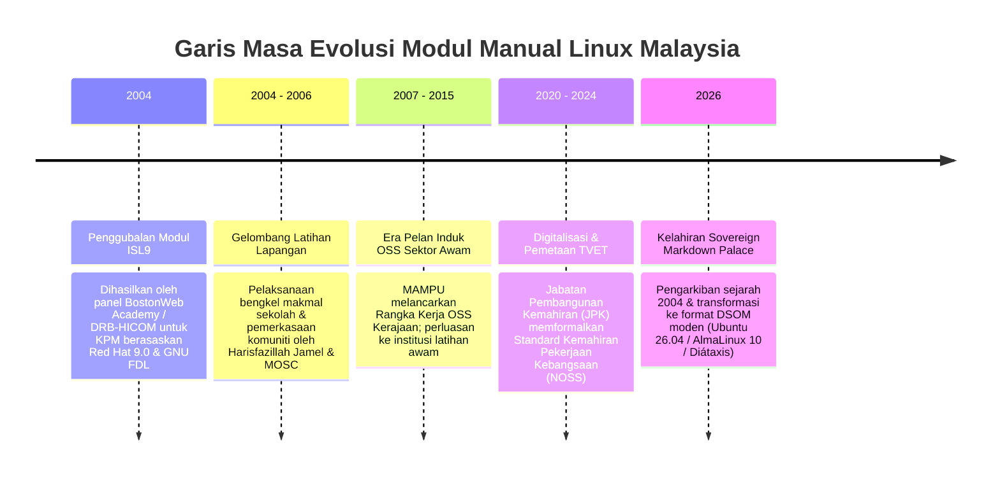

# Sejarah & Asal-Usul Dokumen Manual Linux KPM (2004–2026)

> [!IMPORTANT]
> **PENAFIAN SEJARAH & SUMBER TERHAD (DISCLAIMER):**  
> Rekod sejarah, atribusi panel penggubal, dan latar belakang projek yang didokumentasikan dalam halaman ini adalah **berdasarkan andaian dan dapatan carian sumber terbuka awam (Google) yang terhad**. Ia disusun bagi tujuan pemuliharaan sejarah dan pendidikan tanpa sebarang tuntutan autoriti rasmi.  
> 
> Sekiranya terdapat sebarang kesilapan fakta, ketidaktepatan nama pihak terlibat, atau maklumat sejarah tambahan yang perlu dikemas kini, pihak yang berkaitan amat dialu-alukan untuk menyumbang pembetulan dengan **membuka *Pull Request* (PR) atau memfailkan *Issue*** di repositori ini.

## 1. Pengenalan & Asal-Usul Modul ISL9 (Mei 2004)

Bahan mentah yang disimpan di dalam direktori `references/manual/` merupakan khazanah sejarah penting dalam gerakan **Perisian Sumber Terbuka (Open Source Software - OSS)** dan literasi sistem pengkomputeran di Malaysia. 

Dokumen ini asalnya digubal di bawah kod modul rasmi:
> **Kod & Versi Modul:** `ISL9-v1.1.3-final5`  
> **Tajuk Dokumen:** *Ministry of Education : Computerisation (IT Lab) - Infrastruktur Sistem & Linux (Panduan Pengajar & Pelatih)*  
> **Tarikh Pengeluaran Rasmi:** 16 Mei 2004  
> **Pelesenan Asal:** Sebahagian kandungan dilepaskan di bawah **GNU Free Documentation License (GNU FDL)** bagi menyokong penyebaran ilmu bebas.

---

## 2. Pihak Terlibat, Panel Penggubal & Konsortium Pembangunan

Penyediaan bahan kurikulum dan pelaksanaan projek pengkomputeran makmal sekolah KPM ini merupakan hasil kerjasama pelbagai pihak merangkumi agensi kerajaan, konsortium industri teknologi, panel penulis teknikal, dan jurulatih lapangan:

### A. Rakan Kerjasama Korporat & Agensi
* **Kementerian Pendidikan Malaysia (KPM):** Bahagian Teknologi Pendidikan (BTP) & Jawatankuasa Projek Pengkomputeran Makmal Komputer Sekolah.
* **BostonWeb Academy Sdn. Bhd.:** Rakan penyedia kandungan kurikulum dan latihan teknikal.
* **DRB-HICOM Information Technologies Sdn. Bhd. / DRB-HICOM Berhad:** Syarikat konsortium pelaksana infrastruktur ICT makmal sekolah.

### B. Panel Penggubal, Editor & Kawalan Kualiti
* **Pembangun Kurikulum & Penulis Teknikal:** Khalid A. Al-Jufry *(Jurucakap & Jurutera Keselamatan Rangkaian Unix)*
* **Penyunting (Editor):** Cheok Lai Fong
* **Penyemak Teknikal (Reviewer):** Asni Nor Rizwan Abdul Rani
* **Penganalisis Kualiti (Quality Analyst):** Azahari Ismail

### C. Pelaksanaan Latihan Lapangan & Komuniti
* **Pelaksana Projek & Jurulatih Lapangan:** **Harisfazillah Jamel (LinuxMalaysia)** bersama barisan jurulatih dan penggerak **Malaysian Open Source Community (MOSC)** yang bertindak melaksanakan latihan amali, bengkel persediaan instruktor, dan sokongan teknikal di sekolah-sekolah di seluruh Malaysia.

---

## 3. Garis Masa Evolusi: Dari Makmal Sekolah ke DSOM NOSS (2004 ➔ 2026)

---

## 4. Perbandingan Pemodenan (2004 vs 2026)

| Aspek | Modul ISL9 (2004) | Sovereign Markdown Palace (2026) |
| :--- | :--- | :--- |
| **Sistem Rujukan** | Red Hat 9.0 (Isirung 2.4, era 2003) | **Ubuntu 26.04 LTS**, **AlmaLinux 10**, **Fedora 43** |
| **Persekitaran Grafik** | XFree86 / GNOME 2.2 | **GNOME 48 / Wayland** |
| **Penyulitan & Storan** | ext2 / ext3 biasa | **LUKS2 (Full Disk Encryption)**, **LVM**, **XFS/ext4** |
| **Format Dokumen** | Manual latihan bercetak / PDF | **Markdown-First**, **Kerangka Diátaxis**, **Google OKF v0.1** |
| **Penyampaian Web** | Tidak tersedia secara terpusat | **HTML Statik:** GitHub/GitLab Pages, Read the Docs, GitBook, Nginx, Apache |
| **Sasaran Pengguna** | Guru Penyelaras ICT Sekolah | Pelajar TVET, Pentadbir Sistem (SysAdmin), & **Ejen AI Autonomi** |
| **Penjajaran** | Inisiatif Makmal Komputer KPM | **National Occupational Skills Standard (NOSS Level 3)** |

---

## 5. Pemuliharaan Arkib Mentah (`references/manual/`)

Berasaskan **Peraturan 17 Perlembagaan AI DSOM**, fail-fail di dalam direktori `references/manual/` diisytiharkan sebagai **Arkib Sejarah Warisan Kekal**. Ia tidak akan dipadam, tetapi dipelihara dalam keadaan yang bersih daripada teks pengepala berulang lapuk bagi menghormati sumbangan seluruh konsortium, panel penulis, dan jurulatih yang telah membina asas ekosistem sumber terbuka di Malaysia.

---

## 6. Kaedah Penemuan Maklumat & Pautan Rujukan Luar (URL)

Penyelidikan asal-usul dokumen ini dijalankan oleh Ejen AI menggunakan teknik padanan rentetan tepat (*exact string search*) pada enjin carian web terhadap metadata yang diekstrak daripada teks manual lama:

### Kata Kunci Siasatan (Search Queries)
1. `"Ministry of Education" "Computerisation" "IT Lab" Malaysia Linux OR "Infrastruktur Sistem"`
2. `"ISL9" "Infrastruktur Sistem & Linux" OR "Khalid A. Al-Jufry" OR "BostonWeb Academy" "Ministry of Education"`

### Senarai Pautan Arkib & Rujukan Terbuka
- [Scribd: 12 Sistem Operasi Linux (Modul ISL9 KPM)](https://www.scribd.com/document/217983693/12-Sistem-Operasi-Linux) — Salinan arkib awam modul ISL9 (*Infrastruktur Sistem & Linux*).
- [GNU Free Documentation License (GFDL) v1.3](https://www.gnu.org/licenses/fdl-1.3.html) — Terma pelesenan dokumen bebas GNU asal yang diguna pakai dalam modul pengkomputeran sekolah KPM.
- [Portal Rasmi Bahagian Sumber dan Teknologi Pendidikan (BSTP KPM)](https://moe.gov.my) — Laman rasmi Kementerian Pendidikan Malaysia bagi pembudayaan teknologi pendidikan.
- [Malaysian Open Source Community (MOSCMY)](https://github.com/moscmy) — Repositori dan arkib inisiatif komuniti sumber terbuka Malaysia.
- [Portal MAMPU: Dasar Sumber Terbuka Sektor Awam](https://www.mampu.gov.my) — Sejarah pelan induk pelaksanaan perisian sumber terbuka (OSS) dalam agensi kerajaan Malaysia.

---
*Linux for NOSS Malaysia (Sovereign Markdown Palace) | Harisfazillah Jamel (LinuxMalaysia) | 2026-08-16*
*Standard: UK English | DBP-standard Bahasa Melayu Malaysia (Piawai) | Dwi-Lesen: CC BY-SA 4.0 (Kandungan) / MIT (Skrip) | [Notis Perundangan, Privasi & Penafian](/docs/legal-notice.md)*
