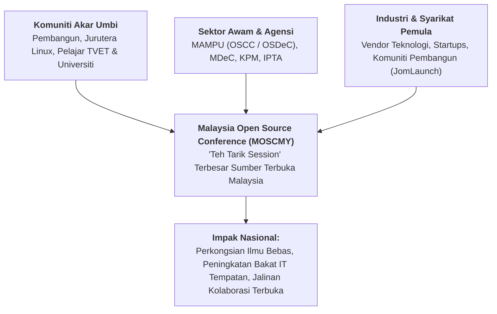

# Sejarah Malaysia Open Source Conference: MOSC / MOSCMY / OSSCONF (2009–2019)

> [!IMPORTANT]
> **PENAFIAN SEJARAH & PEMULIHARAAN MEMORI KOMUNITI:**  
> Rekod sejarah penganjuran **Malaysia Open Source Conference (MOSC / MOSCMY / OSSCONF)** ini disusun berasaskan penemuan arkib terbuka, catatan komuniti, dan carian digital awam yang semakin pudar dan menghilang dari laman web aktif.  
> 
> Halaman ini diwujudkan sebagai sebahagian daripada inisiatif merakamkan sejarah gerakan komuniti sumber terbuka di Malaysia. Penggerak, sukarelawan, atau pembentang persidangan dialu-alukan untuk membetulkan kronologi atau menyumbangkan bahan sejarah melalui **Pull Request (PR)** atau **Issue** di repositori ini.

---

## 1. Pengenalan & Semangat Gerakan MOSC

**Malaysia Open Source Conference**, yang masyhur dikenali melalui akronim **MOSC**, **MOSCMY**, **MOSC.my**, atau persidangan rintisannya **OSSCONF**, merupakan perhimpunan tahunan terbesar bagi pembangun, pentadbir sistem, penyelidik, dan peminat perisian sumber terbuka (OSS) di Malaysia.

Persidangan ini unik kerana ia dipacu sepenuhnya oleh **semangat kesukarelawanan komuniti akar umbi (*community volunteer-driven*)**. Ia sering diangkat sebagai **"Teh Tarik Session" Terbesar** bagi ekosistem teknologi terbuka negara — menghimpunkan para penggodam (*hackers*), pelajar universiti, syarikat pemula (*startups*), barisan penjawat awam pemacu OSS, serta tetamu pembentang antarabangsa di bawah satu bumbung tanpa jurang hierarki korporat.

---

## 2. Garis Masa Kronologi Penganjuran

Sejak dimulakan pada penghujung dekad 2000-an, MOSC telah merentasi pelbagai fasa perkembangan:

| Tahun / Edisi | Nama Acara & Tema Utama | Lokasi / Catatan Penting |
| :--- | :--- | :--- |
| **2009** | *MSC Malaysia Open Source Conference (MOSC 2009)* | Titik tolak penganjuran persidangan skala nasional menggabungkan inisiatif MSC Malaysia dan komuniti sumber terbuka. |
| **2010 – 2012** | *MOSC.my Annual Conferences* | Mengetengahkan topik pengkomputeran awan (*Cloud Computing*), kernel Linux, pangkalan data MySQL/PostgreSQL, dan keselamatan sistem. |
| **2013 – 2014** | *MOSC National Open Source Movement* | Memperluaskan pembabitan komuniti pemaju tempatan, pembangunan web berasaskan Python, PHP, Ruby, dan sistem pelayan Linux. |
| **2015** | *MOSC 2015 Melaka* | Penganjuran di luar Lembah Klang bagi meluaskan kesedaran sumber terbuka ke peringkat negeri. |
| **2016 – 2017** | *MOSC 2016 & MOSC 2017 (UKM Bangi)* | Diadakan di Universiti Kebangsaan Malaysia (UKM) dengan penglibatan ribuan peserta IPTA, pertandingan *hackathon*, dan kolaborasi bersama acara komuniti seperti *JomLaunch*. |
| **2018 – 2019** | *MOSCMY Community Summits* | Memfokuskan kepada automasi DevOps, kontena (Docker/Kubernetes), kecerdasan buatan sumber terbuka, dan Internet of Things (IoT). |

---

## 3. Fokus Teknologi & Pengisian Persidangan

MOSC bukan sekadar persidangan akademik, sebaliknya sebuah medan perkongsian teknikal berorientasikan amali (*hands-on*):
- **Sistem Pengendalian & Isirung:** Sesi bedah siasat kod isirung Linux (*Linux Kernel*), pengurusan peranti, dan pembangunan edaran tempatan.
- **Keselamatan Siber & Pengauditan:** Analisis kerentanan (*penetration testing*), keselamatan pelayan terbuka, dan forensik digital.
- **Pembangunan Aplikasi Web & Mudah Alih:** Ekosistem bahasa pengaturcaraan sumber terbuka dan kerangka kerja moden.
- **Data Raya & Pengkomputeran Awan:** Penyelesaian storan teragih, OpenStack, Ceph, dan analitik data raya.
- **Pelesenan Perisian & Advokasi:** Perbincangan hak cipta di bawah lesen GPL, MIT, Apache, dan Creative Commons.

---

## 4. Hubungan Simbiotik Bersama OSCC MAMPU & Dasar Kerajaan

Penganjuran MOSC menjadi jambatan penghubung yang kritikal antara **komuniti sumber terbuka akar umbi** dengan **agensi sektor awam**:
- Pegawai Teknologi Maklumat (PTM) kerajaan dan pasukan daripada **OSCC MAMPU** kerap berkongsi kejayaan migrasi perisian terbuka kerajaan di pentas MOSC.
- Komuniti memberikan maklum balas telus terhadap pelaksanaan **Pelan Induk OSS Sektor Awam**, menghasilkan sinergi positif antara pembuat dasar dan pengamal teknologi lapangan.

---

## 5. Kepentingan Memelihara Arkib MOSC

Kebanyakan portal rasmi edisi terdahulu (seperti domain arkib `mosc.my` 2009–2017) kini tidak lagi dapat diakses secara langsung berikutan tamatnya tempoh langganan pelayan dan domain komuniti. 

Dokumentasi ini merakamkan penghormatan kepada seluruh jawatankuasa sukarelawan, penaja, pembentang, dan peserta yang telah membina legasi kebanggaan gerakan sumber terbuka di Malaysia.

---

## 6. Pautan Rujukan & Arkib Terbuka

- [Malaysian Open Source Community (MOSCMY) di GitHub](https://github.com/moscmy) — Repositori rasmi komuniti penggerak MOSC.
- [Ticket2U Event Archives - MOSC](https://www.ticket2u.com.my) — Rekod arkib pendaftaran dan agenda penganjuran tahunan MOSC.
- [Laman Ilmu Cyber](https://harisfazillah.info) — Arkib penulisan dan catatan sejarah pergerakan sumber terbuka di Malaysia.

---
*Linux for NOSS Malaysia (Sovereign Markdown Palace) | Harisfazillah Jamel (LinuxMalaysia) | 2026-08-16*
*Standard: UK English | DBP-standard Bahasa Melayu Malaysia (Piawai) | Dwi-Lesen: CC BY-SA 4.0 (Kandungan) / MIT (Skrip) | [Notis Perundangan, Privasi & Penafian](/docs/legal-notice.md)*
