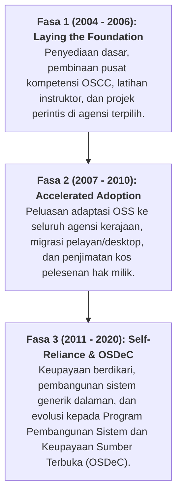

# Sejarah & Warisan OSCC MAMPU: Pusat Kompetensi Sumber Terbuka Malaysia (2004–2020)

> [!IMPORTANT]
> **PENAFIAN SEJARAH, PENYELIDIKAN TERHAD & INISIATIF PENGARKIBAN:**  
> Rekod sejarah penubuhan dan inisiatif **OSCC MAMPU** di dalam dokumen ini disusun berasaskan andaian, arkib digital sedia ada, dan carian sumber terbuka awam yang semakin terhad dan menghilang dari carian web semasa.  
> 
> Halaman ini diwujudkan sebagai usaha permulaan memelihara memori digital inisiatif perisian sumber terbuka sektor awam Malaysia sebelum projek pengarkiban menyeluruh (*dedicated OSCC MAMPU historical archive*) dimulakan. Pihak yang memiliki rekod, laporan, atau bahan arkib dialu-alukan untuk menyumbang melalui **Pull Request (PR)** atau memfailkan **Issue** di repositori ini.

---

## 1. Pengenalan & Penubuhan OSCC MAMPU (16 Julai 2004)

Pada **16 Julai 2004**, Kerajaan Malaysia melalui **MAMPU** (Unit Pemodenan Tadbiran dan Perancangan Pengurusan Malaysia, Jabatan Perdana Menteri) telah melancarkan inisiatif bersejarah iaitu **Pelan Induk Perisian Sumber Terbuka (OSS) Sektor Awam Malaysia**.

Bagi memacu dan menyelaraskan agenda nasional ini, sebuah pusat kecemerlangan khas telah ditubuhkan:
* **Nama Entiti:** *Open Source Competency Centre (OSCC) MAMPU* (Pusat Kompetensi Sumber Terbuka MAMPU).
* **Fungsi Utama:** Bertindak sebagai pusat rujukan sehenti, penyedia khidmat kepakaran teknikal, penyelaras latihan keupayaan, dan pemacu adaptasi teknologi sumber terbuka di seluruh kementerian, jabatan, dan agensi sektor awam Malaysia.

---

## 2. 3 Fasa Pelan Induk OSS Sektor Awam Malaysia

Pelan Induk OSS Sektor Awam yang dipacu oleh OSCC MAMPU dirangka mengikut tiga fasa pelaksanaan strategik:

---

## 3. Peranan & Sumbangan Utama OSCC MAMPU

Sepanjang era kegemilangannya, OSCC MAMPU telah menerajui pelbagai pencapaian penting dalam ekosistem ICT negara:

1. **Khidmat Rundingan & Ujian Bukti Konsep (PoC):**
   - Menilai dan menguji kesesuaian perisian sumber terbuka untuk kegunaan agensi awam (pelayan web Apache, pangkalan data MySQL/PostgreSQL, pelayan mel dan fail Linux).
2. **Pusat Latihan & Pembinaan Kompetensi:**
   - Menganjurkan bengkel teknikal untuk Pegawai Teknologi Maklumat (PTM) sektor awam bagi membina kemahiran dalam pentadbiran Linux, keselamatan siber, dan pembangunan perisian bebas.
3. **Repositori Perisian Sumber Terbuka Sektor Awam (OSR):**
   - Mewujudkan platform perkongsian kod sumber dan sistem aplikasi generik antara agensi kerajaan bagi mengelakkan pertindihan kos pembangunan perisian.
4. **Evolusi ke Program OSDeC:**
   - Selepas fasa awal penubuhan, legasi kepakaran OSCC disalurkan kepada program **OSDeC (Open Source System Development and Capability)** yang menumpukan kepada pembangunan sistem dalaman secara *in-house* oleh penjawat awam.
5. **Jalinan Kerjasama Bersama Komuniti & Industri:**
   - Menghubungkan sektor awam dengan komuniti pembangun sumber terbuka tempatan seperti **Malaysian Open Source Community (MOSC)**, universiti awam, dan rakan industri teknologi.

---

## 4. Evolusi Institusi: Daripada MAMPU ke Jabatan Digital Negara (JDN)

Dalam memacu transformasi digital kerajaan yang lebih dinamik dan berdaya saing pada era digital terkini, struktur pentadbiran ICT negara telah melalui penstrukturan semula yang penting:
- **Penubuhan Jabatan Digital Negara (JDN):** Entiti MAMPU telah distrukturkan dan dinaik taraf sebagai **Jabatan Digital Negara (JDN)** di bawah **Kementerian Digital Malaysia**.
- **Peralihan Mandat & Polisi:** Mandat tadbir urus ICT sektor awam, pengukuhan keselamatan digital kerajaan, serta pekeliling perkhidmatan digital kini diterajui secara rasmi oleh Jabatan Digital Negara (JDN).
- **Legasi Kedaulatan Digital:** Usaha dan semangat kedaulatan digital yang dimulakan oleh OSCC MAMPU pada era 2004 kini diteruskan melalui dasar transformasi digital bersepadu, pematuhan keselamatan data awam, dan pemerkasaan teknologi digital kerajaan di bawah JDN.

---

## 5. Kepentingan Pemuliharaan Arkib Sejarah (Digital Heritage)

Memandangkan laman web dan dokumentasi rasmi era OSCC MAMPU semakin sukar diakses berikutan penstrukturan semula agensi kerajaan dan migrasi platform selama dua dekad yang lalu, pemuliharaan fakta dan kronologi inisiatif ini amat kritikal.

Inisiatif pengarkiban khusus akan dilancarkan tidak lama lagi bagi mengumpulkan:
- Dokumen pekeliling am dan garis panduan OSS sektor awam 2004–2015.
- Kertas putih (*whitepapers*), modul latihan asal, dan laporan penjimatan kos pelesenan.
- Bahan sejarah yang mendokumentasikan usaha penjawat awam dan komuniti memartabatkan kedaulatan digital negara.

---

## 6. Pautan Arkib & Rujukan Terbuka

- [Portal Rasmi Kerajaan Malaysia (MyGovernment) - Inisiatif OSDeC MAMPU](https://www.malaysia.gov.my) — Maklumat mengenai kesinambungan program pembangunan sistem dan keupayaan sumber terbuka sektor awam.
- [Open Source Initiative (OSI) - Malaysian Government OSS Master Plan](https://opensource.org) — Catatan arkib antarabangsa mengenai pelancaran Pelan Induk OSS Malaysia 2004.
- [Malaysian Open Source Community (MOSCMY)](https://github.com/moscmy) — Arkib komuniti yang bekerjasama rapat sepanjang era pembangunan OSS di Malaysia.

---
*Linux for NOSS Malaysia (Sovereign Markdown Palace) | Harisfazillah Jamel (LinuxMalaysia) | 2026-08-16*
*Standard: UK English | DBP-standard Bahasa Melayu Malaysia (Piawai) | Dwi-Lesen: CC BY-SA 4.0 (Kandungan) / MIT (Skrip) | [Notis Perundangan, Privasi & Penafian](/docs/legal-notice.md)*
