# Seni Bina Aliran Kerja: Input, Proses & Output (IPO) NOSS Linux Malaysia

Dokumen ini memperincikan keseluruhan kitaran hayat data (*data lifecycle*) dan protokol operasi standard bagi projek **Linux for NOSS Malaysia** di bawah kerangka **Deep State of Mind (DSOM v0.1)**. 

Projek ini beroperasi berlandaskan model tiga fasa utama: **Input (Penerimaan Sumber)** ➔ **Proses (Transformasi, Pemodenan & Pematuhan Kualiti)** ➔ **Output (Penerbitan Multi-Pelantar & Memori Semantik)**.

---

## 🗺️ Gambaran Keseluruhan Aliran Kerja (Architecture Diagram)

```mermaid
flowchart TD
    subgraph INPUT ["1. INPUT (Sumber Bahan Mentah)"]
        I1["Arkib Mentah:<br><code>references/manual/</code><br><code>references/noss/</code>"]
        I2["Muat Naik AI:<br>Google Jules / Antigravity<br>(Teks, PDF, DOCX)"]
        I3["Sumber Web & URL:<br>Dokumentasi Rasmi Linux<br>RFC / Kernel.org / DBP"]
    end

    subgraph PROSES ["2. PROSES (Transformasi, Modenisasi & Kualiti)"]
        P1["<b>Pembersihan & Ekstraksi:</b><br>- Singkir teks berulang lapuk<br>- Pelihara arkib asal (Rule 17)"]
        P2["<b>Pemodenan Kanonik 2026:</b><br>- Ubuntu 26.04 LTS, Fedora 43, AlmaLinux 10<br>- Pengerasan LUKS2 & ISO/IEC 27001 (Rule 15)<br>- Standard Bahasa Melayu Baku DBP (Rule 3)"]
        P3["<b>Pemformatan OKF v0.1:</b><br>- YAML Frontmatter + Metadata<br>- Sovereign Dual-License Footer (Rule 8)"]
        P4["<b>100% Quality Gate:</b><br>- <code>uv run run_all_tests.py</code><br>- Pytest & Jest (Rule 12)"]
    end

    subgraph OUTPUT ["3. OUTPUT (Penerbitan & Memori)"]
        O1["<b>Sovereign Manual NOSS:</b><br><code>manual/cu01/</code> hingga <code>cu06/</code><br>(Modul Amali NOSS Tahap 3)"]
        O2["<b>OpenWiki Silibus:</b><br><code>openwiki/topic-*.md</code><br>(Sintesis & Rujukan Cepat)"]
        O3["<b>Penerbitan Web Prabina:</b><br><code>html/</code> (MkDocs Material)<br>Pautan luar talian (<code>file:///</code>)"]
        O4["<b>DSOM Spatial Memory:</b><br><code>.agents/brain/wings/</code><br><code>palace_registry.md</code>"]
        O5["<b>Penyegerakan GitOps:</b><br>GitLab (<code>origin</code>) & GitHub (<code>github</code>)<br>(Rule 19)"]
    end

    INPUT --> PROSES
    PROSES --> OUTPUT
```



---

## 📥 1. Fasa INPUT (Penerimaan Sumber Pengetahuan)

Semua maklumat dan data mentah yang memasuki ekosistem projek ini mesti melalui salah satu saluran berikut:

| Saluran Input | Lokasi / Kaedah | Perincian Sumber |
| :--- | :--- | :--- |
| **Arkib Mentah Tempatan** | `references/manual/` & `references/noss/` | Dokumen modul sejarah latihan IT Lab/KPM 2004, dokumen silibus NOSS JPK, dan glosari lama. |
| **Muat Naik Sesi Ejen AI** | Google Jules / Google Antigravity | Dokumen DOCX, PDF, imej rajah atau arkib yang dimuat naik oleh pengendali manusia semasa sesi interaktif. |
| **Penyelidikan Web & URL** | `read_url_content` / `search_web` | Dokumentasi rasmi kernel Linux, standard DBP, dokumentasi Ubuntu Server, AlmaLinux Wiki, dan panduan keselamatan MAMPU/CIS Benchmark. |

> [!IMPORTANT]
> **Dasar Pemuliharaan Arkib Mentah (Perlembagaan AI - Peraturan 17):**
> Fail-fail rujukan mentah di dalam `references/` **TIDAK BOLEH DIPADAM** semasa atau selepas transformasi ilmu. Ia kekal sebagai rekod warisan (*permanent archive*).

---

## ⚙️ 2. Fasa PROSES (Transformasi, Modenisasi & Jaminan Kualiti)

Proses pemprosesan menggabungkan automasi skrip Python `uv` dan kepakaran manusia-AI (*Human-AI Synergy*):

### Langkah 2.1: Pembersihan & Ekstraksi Teks
- Menyingkirkan pengepala lama yang berulang (contoh: teks kerahsiaan KPM lama).
- Mengekstrak langkah amali, arahan baris perintah (*CLI*), dan rajah topologi ke dalam struktur modular.

### Langkah 2.2: Pemodenan Silibus ke Piawaian 2026 (Peraturan 15)
- **Distribusi Rujukan Rasmi:**
  - **Desktop / Persekitaran Latihan:** Ubuntu 26.04 LTS "Quetzal" (Kernel 6.14 LTS, GNOME 48).
  - **Teknologi Terkini (*Bleeding-Edge*):** Fedora 43.
  - **Pelayan & Desktop Perusahaan (*Enterprise*):** AlmaLinux 10 "Purple Lion" (Kernel 6.12 LTS, GNOME 47).
- **Pengerasan Keselamatan Mandatori:**
  - Penyulitan Cakera Penuh (LUKS2) dengan sokongan berbilang slot kunci (*multi-user key slots*) untuk pematuhan **ISO/IEC 27001** dan **Pekeliling Am MAMPU**.
- **Piawaian Bahasa Melayu Baku (Peraturan 3):**
  - Mengikut ejaan dan tatabahasa Dewan Bahasa dan Pustaka (DBP) Malaysia. Arahan teknikal dan sintaks kod kekal dalam bahasa Inggeris standard.

### Langkah 2.3: Pemformatan Struktur Standard (OKF v0.1 & Diátaxis)
- Setiap nod Markdown baharu mesti mempunyai **OKF v0.1 YAML Frontmatter**:
  ```yaml
  ---
  okf_version: 0.1
  type: knowledge-node # atau knowledge-index, documentation, skill
  title: "Tajuk Modul"
  timestamp: "2026-08-17T00:00:00Z"
  topics: ["noss-linux", "cu02", "storage"]
  tags: ["lvm", "partisi", "amali"]
  description: "Penerangan ringkas dan padat."
  resource: "file:///manual/cu02/nama-fail.md"
  ---
  ```
- **Struktur Penutup Wajib (Peraturan 16):** Mengandungi seksyen *AI Prompts*, *Rujukan URL*, dan *Syor Buku Boleh Dibeli*.
- **Pengaki Berdaulat (Sovereign Dual-License Footer):** Memuatkan atribusi rasmi, dwi-lesen (CC BY-SA 4.0 / MIT), dan pautan Notis Perundangan.

### Langkah 2.4: 100% Quality Gate Orchestration (Peraturan 12)
Sebelum sebarang komit dibenarkan:
```bash
uv run run_all_tests.py
```
Ujian merangkumi:
1. **Pytest:** Pengesahan skema OKF, kesahan timestamp ISO8601, pautan `resource:`, padanan footer, keserasian sistem fail Windows NTFS Junction / Linux Symlink, dan integriti skrip Python.
2. **Jest (npm test):** Ujian integrasi JavaScript pelayar.

---

## 📤 3. Fasa OUTPUT (Penerbitan & Penyimpanan Memori)

Hasil akhir pemprosesan diagihkan ke beberapa sasaran mengikut peranannya:

### 1. `manual/` (Sovereign Manual NOSS)
- Mengandungi modul teknikal amali lengkap mengikut pecahan 6 Unit Kompetensi (CU01 hingga CU06) bagi standard NOSS Level 3:
  - `manual/cu01/`: Persediaan Sistem Komputer & Desktop Linux
  - `manual/cu02/`: Pengurusan Storan & Hipervisor Pemayaan
  - `manual/cu03/`: Pentadbiran Pelayan & Perkhidmatan Linux
  - `manual/cu04/`: Automasi, Sandaran & Pemulihan Sistem
  - `manual/cu05/`: Kawalan Keselamatan Endpoint & Pengerasan
  - `manual/cu06/`: Troubleshooting, Sokongan & Pengurusan RCA

### 2. `openwiki/` (Pangkalan Rujukan Silibus & Sintesis Cepat)
- Menyediakan pandangan makro mengikut topik silibus untuk bacaan pantas pelajar dan tenaga pengajar tanpa memuatkan perincian amali penuh.

### 3. `html/` (Pengedaran Tapak Web Statik Prabina)
- Dijana melalui `uv run scripts/serve_mkdocs.py --build-only`.
- Menggunakan mod pautan berkait (`use_directory_urls: false`) yang membolehkan pengguna membuka laman web secara luar talian (`file:///`) tanpa memerlukan pelayan web aktif.
- Dijejak terus dalam Git supaya pengguna `git pull` boleh terus membacanya.

### 4. `.agents/brain/` (Memori Semantik & Ruang Loci Ejen AI)
- **Spatial Memory (`.agents/brain/wings/`):** Menyimpan fakta mutlak dan status kurikulum untuk mengelakkan *context decay*.
- **Palace Registry (`.agents/brain/palace_registry.md`):** Peta memori lengkap ejen AI.
- **Episodic Handover:** Rekod penyerahan tugas antara ejen (contohnya Google Jules ➔ Antigravity) melalui `task.md`, `walkthrough.md`, dan `handover_to_<agent>.md`.

### 5. Dwi-Pelantar GitOps (`origin` & `github`)
- Perubahan disimpan dalam jejak audit Git yang teliti (`git commit`) dan disegerakkan ke remote GitLab (`origin`) dan GitHub (`github`).

---
*Linux for NOSS Malaysia (Sovereign Manual) | Harisfazillah Jamel (LinuxMalaysia) | 2026-08-17*  
*Standard: UK English | DBP-standard Bahasa Melayu Malaysia (Piawai) | Dwi-Lesen: CC BY-SA 4.0 (Kandungan) / MIT (Skrip) | [Notis Perundangan, Privasi & Penafian](/docs/legal-notice.md)*
