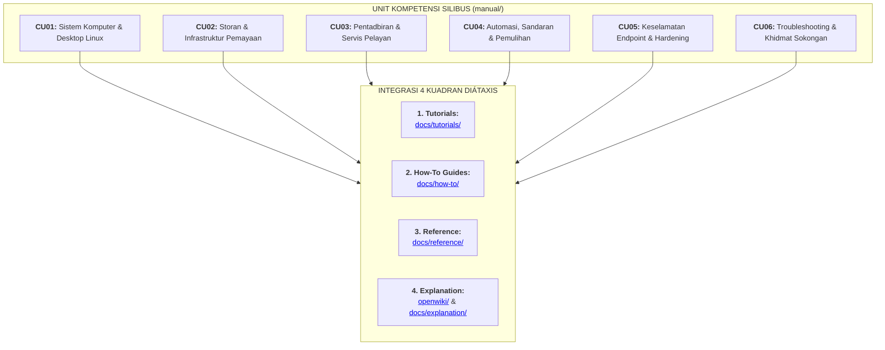

# 📚 Pusat Rujukan Manual NOSS Linux Malaysia (Diátaxis Master Index)

Selamat datang ke **Sovereign Manual NOSS Linux Malaysia**. Halaman ini berfungsi sebagai **pusat rujukan sehenti (*centralised local reference portal*)** bagi pengendali manusia dan ejen AI. 

Kesemua modul pembelajaran disusun secara sistematik mengikut **Piawaian Kemahiran Pekerjaan Kebangsaan (NOSS Level 3)** dan dipadankan dengan **4 Kuadran Kerangka Diátaxis**.

---

## 🗺️ Matriks Integrasi Silibus NOSS & Kerangka Diátaxis

---

## 📑 Direktori Unit Kompetensi (NOSS Level 3)

| Kod Unit | Tajuk Kompetensi NOSS | Modul Amali & Aktiviti Kerja | Rujukan Diátaxis Terpaut |
| :--- | :--- | :--- | :--- |
| [**CU01**](cu01/index.md) | **Persediaan Sistem Komputer & Desktop Linux** | - [Pemasangan OS Desktop](cu01/cu01-wa04-pemasangan-os-desktop-linux.md) - [Penyulitan LUKS2](cu01/penyulitan-cakera-luks2-pejabat.md) - [Perkakasan & BIOS/UEFI](cu01/keperluan-perkakasan-dan-bios-uefi.md) - [Pasca Pemasangan](cu01/pasca-pemasangan-dan-driver.md) | **Explanation:** [OpenWiki Topik 1](../openwiki/topic-01-linux-desktop-and-basics.md) **Tutorial:** [Getting Started](../docs/tutorials/getting-started.md) |
| [**CU02**](cu02/index.md) | **Pengurusan Storan & Hipervisor Pemayaan** | - [Keperluan Pemayaan](cu02/cu02-wa01-keperluan-infrastruktur-pemayaan.md) - [Pemasangan Hipervisor](cu02/cu02-wa02-pemasangan-hipervisor-jenis-2.md) - [Penyebaran VM Tetamu](cu02/cu02-wa03-penyebaran-mesin-maya-tetamu.md) - [Storan & LVM2](cu02/pengurusan-storan-partisi-dan-sistem-fail.md) | **Explanation:** [OpenWiki Topik 2](../openwiki/topic-02-storage-and-virtualisation.md) |
| [**CU03**](cu03/index.md) | **Pentadbiran & Perkhidmatan Pelayan Linux** | - [Persediaan Pelayan](cu03/cu03-wa01-persediaan-pemasangan-pelayan.md) - [Pemasangan OS Pelayan](cu03/cu03-wa03-pemasangan-sistem-operasi-pelayan.md) - [Konfigurasi Teras & SSH](cu03/cu03-wa04-konfigurasi-teras-pelayan.md) - [Servis Web, DNS, Samba](cu03/cu03-wa05-pelaksanaan-peranan-dan-servis-pelayan.md) | **Explanation:** [OpenWiki Topik 3](../openwiki/topic-03-linux-server-administration.md) |
| [**CU04**](cu04/index.md) | **Automasi, Sandaran & Pemulihan Sistem** | - [Alatan Sandaran & Rsync](cu04/cu04-wa01-persediaan-alatan-sandaran-dan-pemulihan.md) - [Sandaran Rangkaian](cu04/cu04-wa03-sandaran-berasaskan-rangkaian.md) - [Pemulihan Bare-Metal](cu04/cu04-wa05-pemulihan-bare-metal-endpoint.md) | **Explanation:** [OpenWiki Topik 4](../openwiki/topic-04-automation-and-backup.md) |
| [**CU05**](cu05/index.md) | **Kawalan Keselamatan Endpoint & Hardening** | - [Audit Pengguna & Sudo](cu05/cu05-wa01-audit-akaun-pengguna-dan-kebenaran.md) - [Antivirus & ClamAV](cu05/cu05-wa02-konfigurasi-pertahanan-antivirus-dan-antimalware.md) - [Profil UFW / Firewalld](cu05/cu05-wa03-konfigurasi-profil-firewall-klien.md) - [Tampalan Keselamatan](cu05/cu05-wa04-pengurusan-tampalan-dan-kemas-kini-keselamatan.md) | **Explanation:** [OpenWiki Topik 5](../openwiki/topic-05-linux-security.md) |
| [**CU06**](cu06/index.md) | **Sokongan Pengguna & Troubleshooting** | - [Khidmat Bantuan IT](cu06/cu06-wa01-keperluan-perkhidmatan-sokongan-pengguna.md) - [Diagnostik Perkakasan](cu06/cu06-wa03-diagnostik-dan-troubleshooting-perkakasan.md) - [Prestasi & Pengoptimuman](cu06/cu06-wa05-pengoptimuman-prestasi-sistem-dan-cakera.md) - [Analisis Punca (RCA)](cu06/cu06-wa07-analisis-punca-anomali-dan-dokumentasi-rca.md) | **Explanation:** [OpenWiki Topik 6](../openwiki/topic-06-troubleshooting-and-logs.md) |

---

## 🌐 Navigasi Pantas 4 Kuadran Diátaxis

- 🎓 **[Tutorials (Pembelajaran Berpandu)](../docs/tutorials/index.md):** Sesuai untuk pemula memulakan langkah praktikal pertama.
- 🛠️ **[How-To Guides (Panduan Operasi)](../docs/how-to/execute-noss-content-transformation.md):** Resipi pantas bagi pentadbir sistem menyelesaikan isu harian.
- 📖 **[Reference (Spesifikasi & Standard)](../docs/reference/index.md):** Spesifikasi teknikal, senarai arahan, dan kemahiran AI.
- 💡 **[Explanation (Kefahaman & Falsafah)](../openwiki/index.md):** Analisis teori, perbandingan teknologi, dan falsafah sumber terbuka.

---
*Linux for NOSS Malaysia (Sovereign Manual) | Harisfazillah Jamel (LinuxMalaysia) | 2026-08-17*  
*Standard: UK English | DBP-standard Bahasa Melayu Malaysia (Piawai) | Dwi-Lesen: CC BY-SA 4.0 (Kandungan) / MIT (Skrip) | [Notis Perundangan, Privasi & Penafian](/docs/legal-notice.md)*
