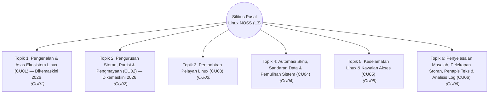

# 🧠 OpenWiki Master Graph (Linux NOSS Syllabus)

Dokumen ini memaparkan gambaran visual dan hierarki bagi kesemua topik NOSS (Level 3) Linux yang sedia ada di dalam pangkalan data `openwiki/`. 
Graf ini dijana secara automatik menggunakan teknologi *Mermaid.js*.

## Peta Topik dan Pemetaan CU

## Perincian Modul

| Topik | Kod CU | Penerangan |
|---|---|---|
| [Topik 1: Pengenalan & Asas Ekosistem Linux (CU01) — Dikemaskini 2026](topic-01-linux-desktop-and-basics.md) | CU01 | Silibus komprehensif CU01 dikemaskini dengan edaran rujukan 2026 (Ubuntu 26.04 LTS, Fedora 43, AlmaLinux 10), penyulitan LUKS2, konfigurasi $EDITOR/$VISUAL, dan prosedur pemasangan NOSS Level 3. |
| [Topik 2: Pengurusan Storan, Partisi & Pengmayaan (CU02) — Dikemaskini 2026](topic-02-storage-and-virtualisation.md) | CU02 | Silibus pengurusan storan fizikal/logikal (GPT, LVM2, EXT4/XFS/Btrfs, LUKS2) dan pengmayaan (KVM/QEMU/libvirt) Linux dipetakan kepada NOSS CU02. |
| [Topik 3: Pentadbiran Pelayan Linux (CU03)](topic-03-linux-server-administration.md) | CU03 | Silibus pentadbiran pelayan Linux, pengurusan perkhidmatan systemd, konfigurasi teras pelayan, dan peranan servis pelayan dipetakan kepada NOSS CU03. |
| [Topik 4: Automasi Skrip, Sandaran Data & Pemulihan Sistem (CU04)](topic-04-automation-and-backup.md) | CU04 | Silibus automasi skrip Bash, pengarkiban dan pemampatan tar/zstd, penyegerakan rsync, automasi berkala cron/systemd-timer, dan pemulihan data dipetakan kepada NOSS CU04. |
| [Topik 5: Keselamatan Linux & Kawalan Akses (CU05)](topic-05-linux-security.md) | CU05 | Silibus keselamatan OS Linux komprehesif merangkumi Pentadbiran Pengguna & Kumpulan, Kebenaran Fail & POSIX ACL, Firewall, dan Kawalan Lockdowns. |
| [Topik 6: Penyelesaian Masalah, Pelekapan Storan, Penapis Teks & Analisis Log (CU06)](topic-06-troubleshooting-and-logs.md) | CU06 | Silibus penyelesaian masalah sistem, pelekapan storan mount/fstab, penapis teks grep/sed/awk, penyunting teks Vim/Neovim/Nano, penyuntingan selamat sudoedit/visudo, pemantauan prestasi, dan dokumentasi RCA dipetakan kepada NOSS CU06. |

---
*Linux for NOSS Malaysia (Sovereign Markdown Palace) | Harisfazillah Jamel (LinuxMalaysia) | 2026-08-25*
*Standard: UK English | DBP-standard Bahasa Melayu Malaysia (Piawai) | Dwi-Lesen: CC BY-SA 4.0 (Kandungan) / MIT (Skrip) | [Notis Perundangan, Privasi & Penafian](/docs/legal-notice.md)*
