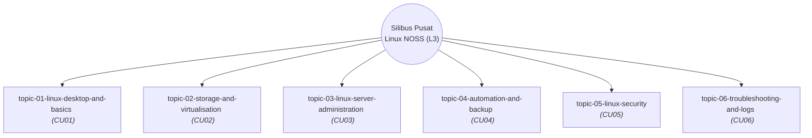

# 🧠 OpenWiki Master Graph (Linux NOSS Syllabus)

Dokumen ini memaparkan gambaran visual dan hierarki bagi kesemua topik NOSS (Level 3) Linux yang sedia ada di dalam pangkalan data `openwiki/`. 
Graf ini dijana secara automatik menggunakan teknologi *Mermaid.js*.

## Peta Topik dan Pemetaan CU

## Perincian Modul Silibus & Pemetaan Diátaxis

| Topik Silibus (Explanation) | Kod CU | Modul Amali NOSS (Reference) | Penerangan & Skop |
|---|---|---|---|
| [**Topik 1: Desktop & Asas**](topic-01-linux-desktop-and-basics.md) | CU01 | [manual/cu01/](../manual/cu01/index.md) | Silibus asas Sistem Operasi Linux (Desktop Ubuntu 26.04/AlmaLinux 10, FHS, APT/DNF, LUKS2). |
| [**Topik 2: Storan & Pemayaan**](topic-02-storage-and-virtualisation.md) | CU02 | [manual/cu02/](../manual/cu02/index.md) | Pengurusan storan cakera GPT, LVM2, sistem fail XFS/EXT4, dan hipervisor KVM/QEMU. |
| [**Topik 3: Pentadbiran Pelayan**](topic-03-linux-server-administration.md) | CU03 | [manual/cu03/](../manual/cu03/index.md) | Pentadbiran pelayan Linux, SSH Hardening, servis Nginx/Apache, DNS BIND9, dan Samba/NFS. |
| [**Topik 4: Skrip & Automasi**](topic-04-automation-and-backup.md) | CU04 | [manual/cu04/](../manual/cu04/index.md) | Automasi skrip Bash, pengurusan jadual Cron/systemd timers, dan operasi sandaran RSync/Borg. |
| [**Topik 5: Keselamatan Linux**](topic-05-linux-security.md) | CU05 | [manual/cu05/](../manual/cu05/index.md) | Kawalan keselamatan endpoint, audit akaun/sudo, ClamAV, UFW/Firewalld, dan tampalan automatik. |
| [**Topik 6: Diagnostik & Log**](topic-06-troubleshooting-and-logs.md) | CU06 | [manual/cu06/](../manual/cu06/index.md) | Diagnostik perkakasan, analisis log systemd journald, pengurusan SLA tiket, dan dokumentasi RCA. |

---

## 🌐 Navigasi Pusat Mengikut Kuadran Diátaxis

- 🎓 **[Tutorials (Pembelajaran Berpandu)](../docs/tutorials/index.md):** Sesuai untuk pemula memulakan langkah praktikal pertama.
- 🛠️ **[How-To Guides (Panduan Operasi)](../docs/how-to/execute-noss-content-transformation.md):** Resipi penyelesaian masalah khusus pentadbir sistem.
- 📖 **[Reference (Sovereign Manual NOSS)](../manual/index.md):** Modul amali standard CU01–CU06 dan spesifikasi teknikal.
- 💡 **[Explanation (Seni Bina Diátaxis)](../docs/explanation/diataxis-architecture.md):** Analisis teori dan tatakelola sistem.

---
*Linux for NOSS Malaysia (Sovereign Manual) | Harisfazillah Jamel (LinuxMalaysia) | 2026-08-17*  
*Standard: UK English | DBP-standard Bahasa Melayu Malaysia (Piawai) | Dwi-Lesen: CC BY-SA 4.0 (Kandungan) / MIT (Skrip) | [Notis Perundangan, Privasi & Penafian](/docs/legal-notice.md)*
