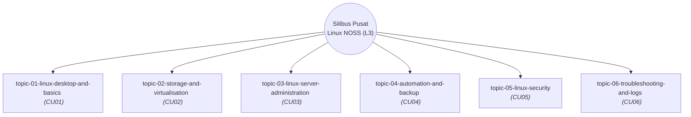

# 🧠 OpenWiki Master Graph (Linux NOSS Syllabus)

Dokumen ini memaparkan gambaran visual dan hierarki bagi kesemua topik NOSS (Level 3) Linux yang sedia ada di dalam pangkalan data `openwiki/`. 
Graf ini dijana secara automatik menggunakan teknologi *Mermaid.js*.

## Peta Topik dan Pemetaan CU

## Perincian Modul

| Topik | Kod CU | Penerangan |
|---|---|---|
| [topic-01-linux-desktop-and-basics](topic-01-linux-desktop-and-basics.md) | CU01 | Silibus asas Sistem Operasi Linux (Desktop, FHS, APT/YUM) dipetakan kepada NOSS CU01. |
| [topic-02-storage-and-virtualisation](topic-02-storage-and-virtualisation.md) | CU02 | Silibus pengurusan storan dan mesin maya (KVM) Linux dipetakan kepada NOSS CU02. |
| [topic-03-linux-server-administration](topic-03-linux-server-administration.md) | CU03 | Silibus pentadbiran pelayan Linux (Apache, SSH, Samba) dipetakan kepada NOSS CU03. |
| [topic-04-automation-and-backup](topic-04-automation-and-backup.md) | CU04 | Silibus automasi skrip dan sandaran Linux (Cron, Bash, Rsync) dipetakan kepada NOSS CU04. |
| [topic-05-linux-security](topic-05-linux-security.md) | CU05 | Silibus keselamatan OS Linux (Kebenaran fail, Firewall, Polisi) dipetakan kepada NOSS CU05. |
| [topic-06-troubleshooting-and-logs](topic-06-troubleshooting-and-logs.md) | CU06 | Silibus penyelesaian masalah, rangkaian, dan semakan log Linux dipetakan kepada NOSS CU06. |

---
*Linux for NOSS Malaysia (Sovereign Markdown Palace) | Harisfazillah Jamel (LinuxMalaysia) | 2026-08-16*
*Standard: UK English | DBP-standard Bahasa Melayu Malaysia (Piawai) | Dwi-Lesen: CC BY-SA 4.0 (Kandungan) / MIT (Skrip)*
